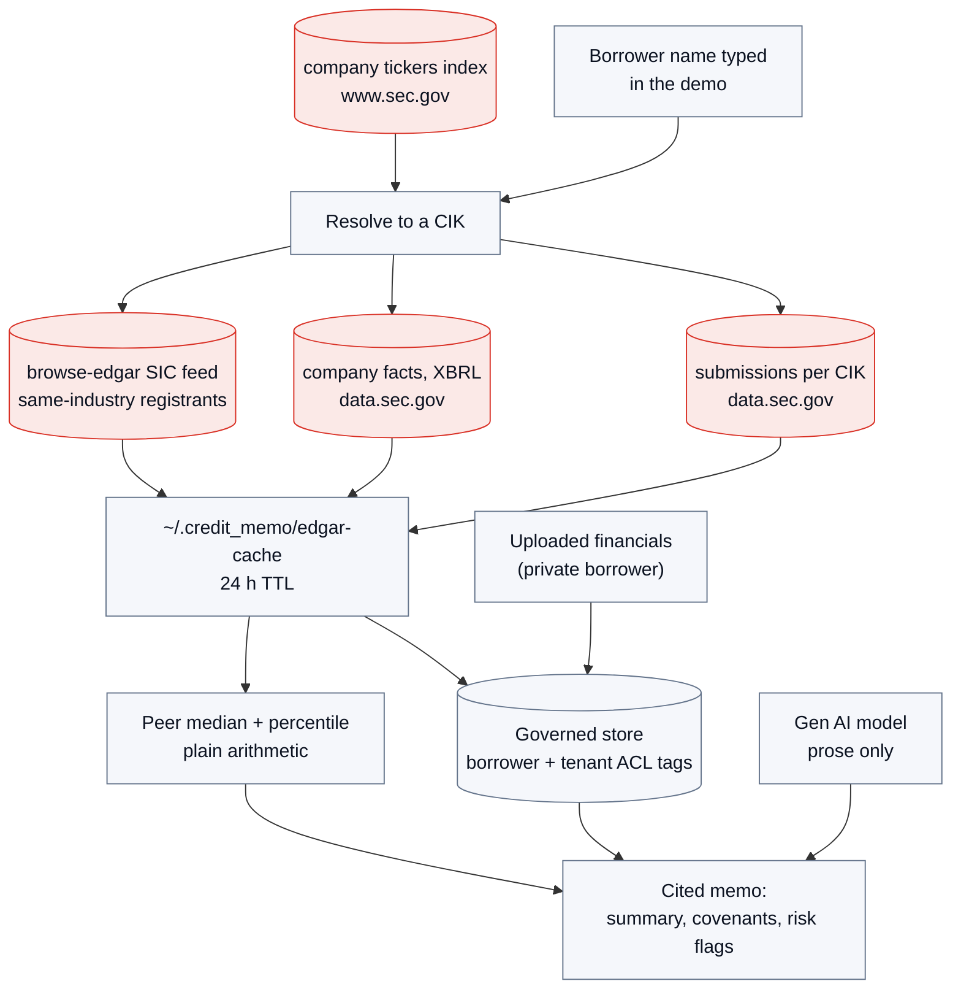
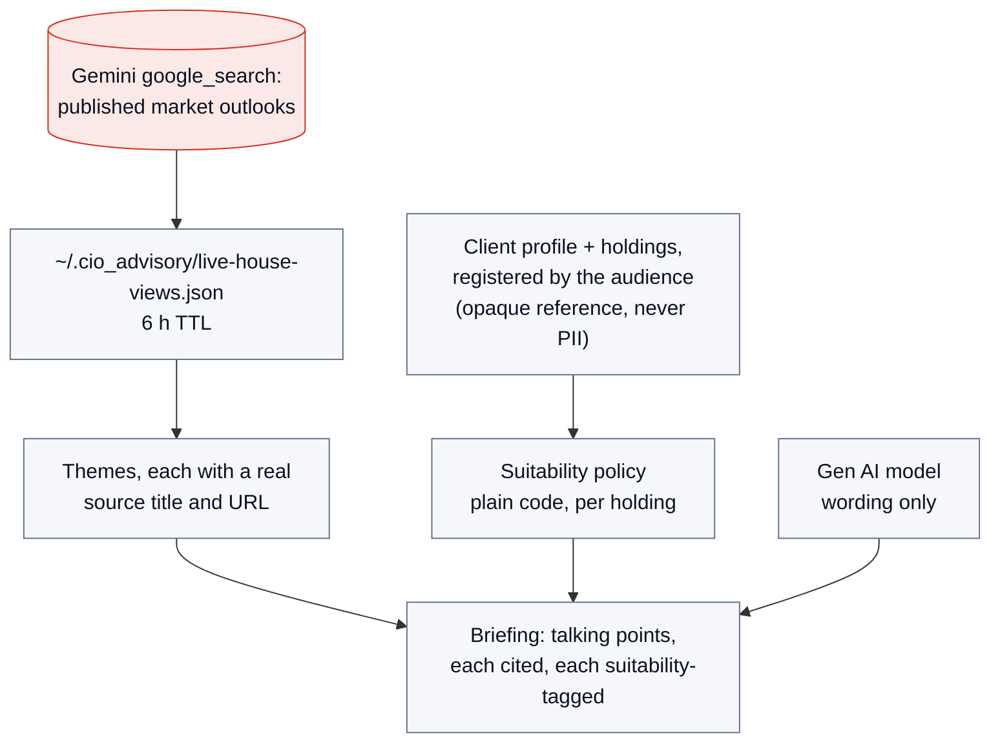
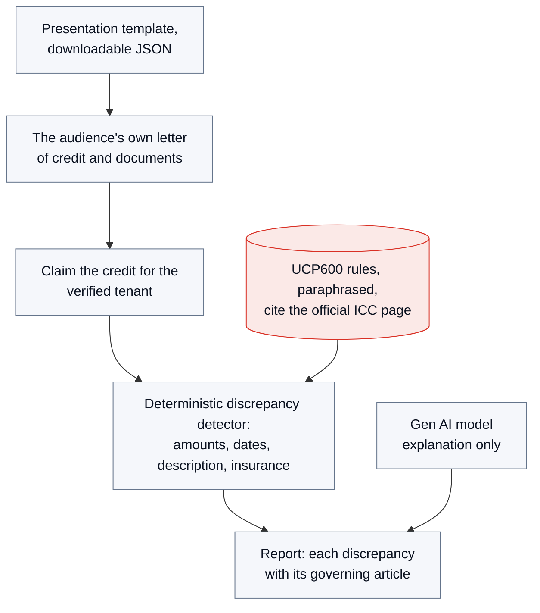
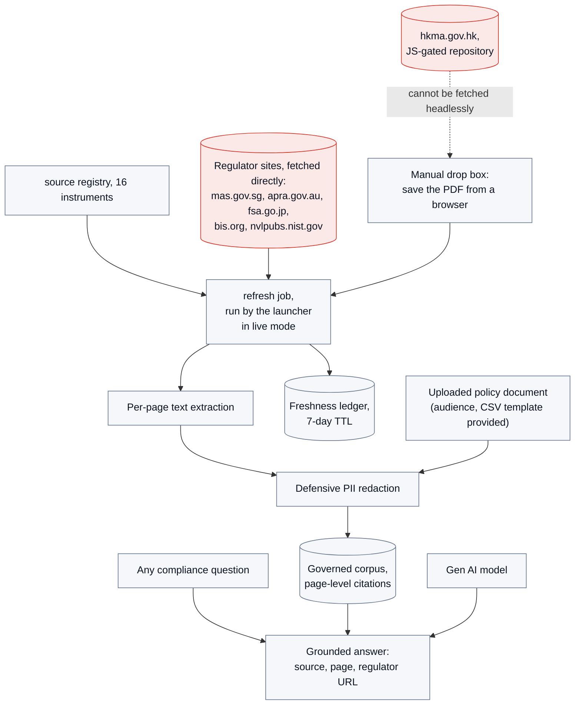
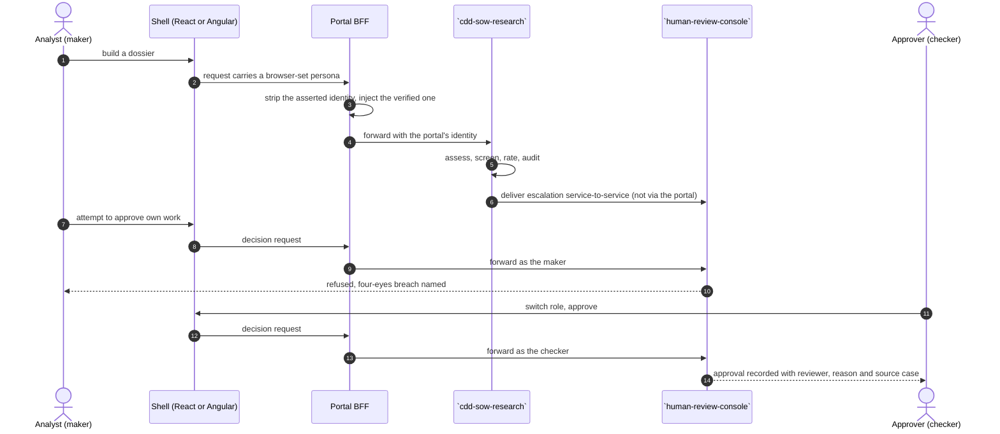

# DEMO: `journey-portal`

Three ways to show it: a **zero-dependency offline audit view** (no repos, no network), the
**full live portal on one machine** (the two shells hosting the real embedded apps), and the
**same portal deployed on Google Cloud**, where the identical modules run on the managed stack
behind Identity-Aware Proxy. Sections 1 and 2 are the machine you are sitting at; [3.9](#39-where-it-runs-one-machine-or-google-cloud)
is the cloud deployment and what changes in it.

## 1. Offline audit view (30 seconds, nothing to install)

```bash
pip install -e ".[dev]"
make demo            # writes scripts/out/portal_demo.html
open scripts/out/portal_demo.html
```

It renders, from the real domain code:

- the two journeys (RM, Ops) and the apps each composes, with the same-origin mount paths; and
- three worked identity cases (a browser trying to escalate with a spoofed `X-Dev-Persona`, a
  forged IAP header in local, and the real IAP passthrough in cloud), each showing the inbound
  headers versus what the portal forwards: the spoof struck through, the verified identity
  injected; and
- two tenant policy decisions: an exact host/tenant/origin allow and a cross-tenant denial, with
  framing output, evidence id, finding and next action; and
- the exact content-free event handed to `agent-observability`, with only keyed actor/tenant references and bounded
  route metadata; and
- a verified local portal-access ledger panel showing the record count and retained SHA-256 head
  hash without request bodies, queries, credentials or identity assertions.

The command also writes `scripts/out/portal_audit_integrity.json`,
`scripts/out/portal_embed_policy.json`, and `scripts/out/portal_observability_event.json`, the
dependency-free reviewer views consumed by the HTML panels.

This is the security story on one page, and it needs none of the embedded apps running.

You can also drive the config and identity from the CLI:

```bash
journey-portal journeys      # list journeys and their apps + upstreams
journey-portal validate      # fail-closed config check (exit 2 on a bad config)
```

## 2. Full live portal on one machine (the pitch demo)

Everything in this section runs on the presenter's own machine, which is what makes it usable
without a project, a network or a bill. The same portal deployed on Google Cloud is
[3.9](#39-where-it-runs-one-machine-or-google-cloud); the modules and the flows are the same
there, and the profile string is what changes.

Prerequisites: the sibling app repos present in the workspace with their deps installed, plus
`npm ci` in `ui-rm` and `ui-ops`. Each embedded backend runs with that app repository's
`.venv/bin/python`; if one is missing the launcher prints its portal-interpreter fallback before
starting. Then, from the repo root:

```bash
python scripts/run_journeys.py --dry-run   # see the launch plan first
make journeys                # brings up every app backend + UI, the BFF, and both shells
```

The launcher waits for each backend's `/healthz`, every embedded UI, the BFF, and the selected
shells before it says the demo is ready. It prints a `READY` / `FAILED` table and stops all child
processes on a failed check, so an unavailable app is identified by name instead of surfacing as a
blank frame.

With the launcher still running, prove the full composition through the portal BFF origin only:

```bash
python scripts/smoke_journeys.py                 # after an unscoped launch
python scripts/smoke_journeys.py --journey mkt   # after `run_journeys.py --journey mkt`
```

The smoke discovers every configured mount from `/v1/journeys`, checks
`/apps/<id>/api/healthz` for each one, and requires `profile: local` (the offline demo) or
`profile: live`; any other profile fails. Pass the same `--journey` the launcher was given: the
portal serves its whole static catalog whatever was started, so an unscoped smoke after a scoped
launch checks apps that are not running.

It then selects the `analyst` through `/v1/session/persona` and sends a real `human-review-console` review request
through `/apps/human-review-console/api/v1/reviews`. The request intentionally carries a conflicting browser
persona; the returned review maker must be the portal-selected analyst, proving the portal
stripped the spoof and injected its verified identity. It then selects the `approver` and
withdraws that item, which does two things at once: it leaves the review queue exactly as it was
found, because the demonstration presents that queue and says out loud what is in it, and the
withdrawal is itself a second identity proof, accepted only because the portal injected a
different verified principal that the console checked against the item's maker. The two personas
have to differ, because the console refuses a self-approval. The command exits non-zero on any
failed assertion, the undisposed item included. This is deliberately a separate portal-identity
check; it is not the `cdd-sow-research` CDD handoff.

On a journey that does not mount `human-review-console` (`rm`), the identity proof is unavailable rather than
failed: the smoke says it is skipping it and why.

For the CDD review step, the launcher supplies a matching, synthetic local S2S credential only to
the `cdd-sow-research` and `human-review-console` backend processes. `cdd-sow-research` writes the CDD escalation to its local durable outbox
and delivers it directly to `http://127.0.0.1:8087/v1/service/reviews`; `journey-portal` neither proxies nor
possesses that credential. `human-review-console`'s persistent local queue then exposes the resulting
`cdd_dossier` item to the Ops journey for approval. Set `JOURNEY_DEMO_S2S_TOKEN` before launch
only when a test needs a different synthetic value; it is not a browser-facing setting.

For a lighter rehearsal, launch only one journey and its matching shell:

```bash
python scripts/run_journeys.py --journey rm
python scripts/run_journeys.py --journey ops
```

For the production-shaped pitch flow, build each embedded Next.js UI once and serve it with
`next start` instead of a development server:

```bash
python scripts/run_journeys.py --built --fresh-state
```

`--fresh-state` makes the approval sequence repeatable by removing only the launcher's synthetic
`cdd-sow-research` delivery outbox and `human-review-console` review queue under `scripts/out/presenter-state/` before startup.
It does not reset `cdd-sow-research`'s knowledge, case, or audit stores, `human-review-console`'s default local database, or any
other sibling-repo data. Omit the option when testing ordinary retry and restart durability. A
`--dry-run --fresh-state` command reports the requested reset but does not change any files.

Use `--readiness-timeout 90` if the first local UI build needs longer than the default 60 seconds.

Open:

- **RM Journey (React):** http://localhost:3000  - tabs for CDD onboarding (`cdd-sow-research`), loan and
  mortgage document intelligence (`loan-document-intelligence`), and CIO advisory (`cio-advisory`).
- **Ops Journey (Angular):** http://localhost:4200  - tabs for credit memo (`credit-memo-drafting`), trade finance
  (`trade-finance-checker`), compliance (`compliance-advisory`), and the human-review queue (`human-review-console`).

### Hosting the live profiles (every journey on real data)

Every embedded app runs its offline profile by default. To host the whole demo doing real
work instead:

```bash
python scripts/run_journeys.py --live
```

The flag switches every journey app to its live profile, each with its own real data source
and no fictional seeds:

| App | Live data | The audience brings |
|---|---|---|
| `cdd-sow-research` CDD | uploaded public filings, grounded research, the synced OFAC/UN watchlists | any subject name and its documents |
| `credit-memo-drafting` Credit memo | the borrower's real SEC EDGAR record + real same-industry peers | any US-listed company, or uploaded financials for a private borrower |
| `cio-advisory` CIO advisory | grounded research over real published market outlooks | a registered client portfolio (JSON template in the UI) |
| `trade-finance-checker` Trade finance | the presentation the audience pastes (template downloadable) | their own LC + documents; the LC is claimed for their tenant on first check |
| `compliance-advisory` Compliance | the REAL regulator instruments (MAS, APRA, JFSA, BCBS, NIST), refreshed at launch | any compliance question; optionally their own policy document via corpus upload |

For `cdd-sow-research` the flag also overrides the triage model with one served in the region this catalog
pins (`asia-southeast1`) and raises the request-body cap to 32 MiB so real PDF uploads are not
rejected. Identity injection, the journey config, and how apps are mounted are unchanged.
Anything you have already exported wins over these defaults. `compliance-advisory`'s regulatory corpus is
refreshed at startup (expired-only within its 7-day TTL, so a warm relaunch does no network
work); `credit-memo-drafting` additionally wants `SEC_EDGAR_CONTACT` exported (an email) because the SEC's
fair-access policy asks automated traffic to identify itself.

Two things must exist outside the portal:

- ONE local OpenAI-compatible model server hosting a Gemma build, shared by the live apps
  still on a local model (`cdd-sow-research` is not among them: every one of its live model calls is the
  Gemini API, org decision 2026-08-30). It is called at
  `http://127.0.0.1:8001/chat/completions` unless `CDD_LIVE_LLM_URL` says otherwise (the
  launcher mirrors that endpoint into each app's own URL variable). Under `--live` the launcher
  brings this up for you, and only when such an app is in the launch plan: if a healthy server
  is already answering on that port it is reused untouched (loading the model takes minutes and
  it is often managed outside this repo), otherwise the launcher runs the command in
  `JOURNEY_MODEL_SERVER_CMD`. If nothing is listening and that variable is unset, the launch
  plan warns and the apps' model calls fail fast rather than hang. A cold model load can exceed
  the default readiness window, so raise `--readiness-timeout` when the launcher starts the
  server itself;
- Google application default credentials and `GOOGLE_CLOUD_PROJECT`, for every `cdd-sow-research` live model
  call (generation, page transcription, and the Gemini `google_search` grounding behind its
  adverse media and corporate registry) and `cio-advisory`'s house-view research. The launcher passes the
  project through from your environment and never invents one; it prints a warning in the
  launch plan when it is unset, and `cdd-sow-research`'s live profile is entirely dead without it.

One more thing should exist for real screening: the synced sanctions snapshot
(`scripts/out/sanctions/current.json` in the `cdd-sow-research` repo, written by its
`scripts/sync_sanctions.py`). When present, the launcher points `cdd-sow-research`'s screening at it via
`CDD_LOCAL_SANCTIONS`; when absent it warns, because screening would otherwise run against
`cdd-sow-research`'s bundled fictional fixture, which a live demo must not do.

What is different in the room: you upload real documents and assess real subject names, and a
dossier build makes several Gemini calls plus a transcription per scanned page, so it takes
minutes rather than seconds. The
launcher therefore starts the BFF with `PORTAL_UPSTREAM_TIMEOUT=600` so a build is not cut short
at the proxy; export your own value to override it. Add `--dry-run` to print the whole live plan,
warning included, without starting anything. `scripts/smoke_journeys.py` accepts a `local` or a
`live` profile from each mounted app and still fails on any other.

For what the live profile actually does, see the
[`cdd-sow-research`](https://github.com/portable-genai/cdd-sow-research) repository.

## 3. How the modules fit together, and where every byte comes from

One diagram cannot hold both the composition and five apps' data sources without becoming
unreadable, so the two are drawn separately: first how the modules are composed, then which module
reaches which source, then one detail diagram per module. Each relationship is drawn once, and an
arrow that belongs to a single module starts at that module rather than at the group around it.

The flows are also drawn once for both deployments. Where a box is a component that a deployment
supplies (the model, document extraction, the governed stores), it is named by what it does rather
than by what happens to be running it, because that is precisely the substitution the hexagon makes
cheap. [3.9](#39-where-it-runs-one-machine-or-google-cloud) is the table that says what fills each
of those boxes on one machine and on Google Cloud, and names the two places where the evidence
itself differs. The named external sources below are the ones the `--live` stack reaches; under the
default offline profile each app's external sources are replaced by its own built-in corpus.

### 3.1 High level: how the modules are composed

```mermaid
flowchart TB
    subgraph browser["Browser (one origin per journey)"]
        RM["RM shell, React/Next"]
        OPS["Ops shell, Angular"]
    end

    BFF["`journey-portal` BFF<br/>reverse proxy + journey config<br/>strips browser identity claims,<br/>injects the verified one"]

    subgraph apps["Embedded apps (own repo, own deployment, own store)"]
        DOC1["`cdd-sow-research` CDD + SoW"]
        DOC2["`credit-memo-drafting` Credit memo"]
        DOC3["`cio-advisory` CIO advisory"]
        DOC4["`trade-finance-checker` Trade finance"]
        RSK1["`compliance-advisory` Compliance"]
        HRZ7["`human-review-console` Human review"]
    end

    MODEL["Gen AI model endpoint<br/>one contract, shared by every app"]

    RM -->|"/apps/*, /v1/*"| BFF
    OPS -->|"/apps/*, /v1/*"| BFF
    BFF ==>|"one reverse-proxy route per app"| apps
    apps -->|"chat completions,<br/>every app but `human-review-console`"| MODEL
    DOC1 ==>|"escalation,<br/>service-to-service"| HRZ7

    classDef shell fill:#eaf1fd,stroke:#1a73e8,color:#0b1220
    classDef infra fill:#eef2ff,stroke:#4338ca,color:#0b1220
    classDef core fill:#e8f6ee,stroke:#0f9d58,color:#0b1220
    class RM,OPS shell
    class BFF,MODEL infra
    class DOC1,DOC2,DOC3,DOC4,RSK1,HRZ7 core
```

The two edges that touch the whole group are drawn once, at the group, rather than repeated per
app: the BFF reverse-proxies each app under its own route, and every app except `human-review-console` calls one
shared model endpoint through the same port. Where an edge is specific to one module it starts at
that module's own box, which is why the `cdd-sow-research`-to-`human-review-console` escalation is the only arrow inside the group.
That edge is deliberately **not** a browser path: `cdd-sow-research` delivers it service-to-service with a
credential the portal never holds. Everything from the browser, by contrast, enters through one
origin, and the BFF is the only thing that decides identity.

On one machine the boxes are processes on localhost; on Google Cloud they are separately deployed
services. The shape of this diagram does not change either way, so the addresses live in
[3.9](#39-where-it-runs-one-machine-or-google-cloud) rather than in the boxes.

### 3.2 Where every byte comes from, and what is kept

Two of the sources are pulled down before the demo starts and then read from disk, so the room
never waits on treasury.gov or on a PDF fetch:

```mermaid
flowchart LR
    OFAC["OFAC SDN + Consolidated CSV<br/>treasury.gov"]
    UN["UN Consolidated XML<br/>scsanctions.un.org"]
    EDGAR["SEC EDGAR<br/>sec.gov + data.sec.gov"]
    SYNC["sync_sanctions.py"]
    PACK["build_demo_pack.py"]
    DOC1["`cdd-sow-research` CDD + SoW"]

    OFAC --> SYNC
    UN --> SYNC
    EDGAR --> PACK
    SYNC -->|"dated snapshot on disk"| DOC1
    PACK -->|"evidence-pack PDFs"| DOC1

    classDef core fill:#e8f6ee,stroke:#0f9d58,color:#0b1220
    classDef out fill:#fbe9e7,stroke:#d93025,color:#0b1220
    classDef proc fill:#f5f7fb,stroke:#64748b,color:#0b1220
    class DOC1 core
    class OFAC,UN,EDGAR out
    class SYNC,PACK proc
```

Everything else is reached while the demo is running. Each module reaches its own sources, so each
arrow below starts at the module that makes the call and says what that call is for:

```mermaid
flowchart LR
    DOC1["`cdd-sow-research` CDD + SoW"]
    DOC2["`credit-memo-drafting` Credit memo"]
    DOC3["`cio-advisory` CIO advisory"]
    RSK1["`compliance-advisory` Compliance"]
    DOC4["`trade-finance-checker` Trade finance"]

    GEMINI["Gemini google_search grounding<br/>Vertex AI, asia-southeast1"]
    EDGAR2["SEC EDGAR<br/>data.sec.gov"]
    REG["Regulator PDFs<br/>MAS, APRA, JFSA, BCBS, NIST"]
    NONE["Nothing external:<br/>the audience brings the data"]

    DOC1 -->|"adverse media and registry,<br/>subject name only"| GEMINI
    DOC3 -->|"house-view research"| GEMINI
    DOC2 -->|"borrower and peer filings"| EDGAR2
    RSK1 -->|"corpus refresh at startup"| REG
    DOC4 --- NONE

    classDef core fill:#e8f6ee,stroke:#0f9d58,color:#0b1220
    classDef out fill:#fbe9e7,stroke:#d93025,color:#0b1220
    classDef none fill:#f5f7fb,stroke:#64748b,color:#0b1220
    class DOC1,DOC2,DOC3,DOC4,RSK1 core
    class GEMINI,EDGAR2,REG out
    class NONE none
```

Only Gemini needs credentials; every other source is public. What each fetch writes, and how long
it is reused, is the table below.

| Source | Fetched by | Written to | Reused |
|---|---|---|---|
| OFAC SDN + Consolidated CSV, UN Consolidated XML | `cdd-sow-research/scripts/sync_sanctions.py` | `scripts/out/sanctions/current.json` (dated snapshot) | `scripts/out/cache/`, 24 h |
| SEC EDGAR submissions + company facts (evidence packs) | `cdd-sow-research/scripts/build_demo_pack.py` | `scripts/out/live-demo/*.pdf` + `manifest.json` | same fetch cache |
| SEC EDGAR tickers, submissions, company facts, SIC peer feed | `credit-memo-drafting`, at request time | `~/.credit_memo/edgar-cache/` | 24 h TTL |
| Regulator PDFs (MAS, APRA, JFSA, BCBS, NIST) | `compliance_advisory.pipelines.refresh_job`, run by the launcher | `~/.compliance_advisory/local.db` + freshness ledger | 7-day TTL |
| Gemini grounded market research | `cio-advisory`, at request time | `~/.cio_advisory/live-house-views.json` | 6 h TTL |
| Gemini grounded adverse media / registry | `cdd-sow-research`, at request time | not cached | per assessment |
| Documents the audience uploads | the app they upload to | that app's own governed store | until removed |

Nothing above is committed to a repository. The caches exist so that a rehearsal, and the demo
run minutes later, do not re-download the same 9 MB of sanctions lists or repeat the same
research.

### 3.3 `cdd-sow-research`, customer due diligence and source of wealth

```mermaid
flowchart TB
    subgraph prep["Prepared once, before the demo"]
        direction TB
        SYNC["sync_sanctions.py"]
        PACK["build_demo_pack.py"]
    end
    OFAC[("OFAC SDN +<br/>Consolidated CSV")]
    UN[("UN Consolidated XML")]
    EDGAR[("SEC EDGAR<br/>data.sec.gov")]
    SNAP["current.json<br/>dated snapshot + lists version"]
    PACKS["live-demo PDFs<br/>each page carries a PROVENANCE line"]

    OFAC --> SYNC --> SNAP
    UN --> SYNC
    EDGAR --> PACK --> PACKS

    subgraph run["At request time"]
        direction TB
        UP["Uploaded document"]
        EXTRACT["Document extraction:<br/>text layer, else page transcription"]
        KB[("Case knowledge base<br/>governed, per page, ACL-tagged")]
        SCREEN["Deterministic name screen<br/>Jaro-Winkler + token set, threshold 0.85"]
        RISK["Risk rating + review policy<br/>plain code"]
        DOSSIER["Cited dossier<br/>every claim carries source + page"]
        AUDIT[("Tamper-evident audit log")]
    end

    PACKS -.->|"the audience uploads one"| UP
    UP --> EXTRACT --> KB --> DOSSIER
    SNAP --> SCREEN --> DOSSIER
    GEM["Gemini google_search:<br/>subject NAME only"] --> DOSSIER
    UP --> MODEL2["Gen AI model<br/>narrative + transcription"]
    MODEL2 --> DOSSIER
    DOSSIER --> RISK --> AUDIT
    DOSSIER ==>|"escalation, service-to-service"| HRZ7X["`human-review-console` review queue"]

    classDef out fill:#fbe9e7,stroke:#d93025,color:#0b1220
    classDef proc fill:#f5f7fb,stroke:#64748b,color:#0b1220
    classDef store fill:#eef2ff,stroke:#4338ca,color:#0b1220
    class OFAC,UN,EDGAR,GEM out
    class SYNC,PACK,SNAP,PACKS,UP,EXTRACT,SCREEN,RISK,DOSSIER,MODEL2,HRZ7X proc
    class KB,AUDIT store
```

The data boundary is the point: whole documents are read and narrated inside the deployment,
and only the subject **name** ever reaches grounded web research. On one machine that boundary is
the machine; on Google Cloud it is the region and the service perimeter, and it is the same
adapter making the same name-only call. The two groups separate what is prepared before the demo
from what happens on the request the audience triggers.

### 3.4 `credit-memo-drafting`, credit memo



A borrower EDGAR does not know is left evidence-less on purpose: the memo then fails closed
rather than grounding on anything invented, and the uploaded-financials path is how a private
name gets briefed.

### 3.5 `cio-advisory`, CIO advisory



### 3.6 `trade-finance-checker`, trade finance



No external system is called at request time here: the data is what the audience brings and the
verdicts are computed by plain code inside the deployment. The rule text is this project's own
paraphrase because the full UCP600 text is licensed by the ICC; each citation points at the
official ICC publication page.

### 3.7 `compliance-advisory`, compliance



Redaction runs on extracted **text**, never on a PDF's raw bytes, which is what keeps the
page-level citations intact.

### 3.8 `human-review-console`, human review, and the identity path



### 3.9 Where it runs: one machine, or Google Cloud

Everything above is drawn once because the flow is the same in both places. What changes is which
adapter fills each port, and that is a profile string rather than a code change: on a presenter's
machine every app runs its `live` profile, and on Google Cloud the same apps run `gcp`. The portal
itself is the same service with `PORTAL_PROFILE=gcp`.

```mermaid
flowchart TB
    USER["Signed-in user, browser"]
    IAP["HTTPS load balancer<br/>+ Identity-Aware Proxy"]
    BFF["`journey-portal` BFF<br/>Cloud Run, internal ingress only<br/>verifies the assertion, passes it on"]
    APPS["The seven app services<br/>Agent Runtime / Cloud Run<br/>each re-verifies the assertion itself"]
    VERTEX["Vertex AI<br/>Gemini + Vertex AI Search"]
    STATE["Governed state<br/>Firestore, BigQuery, AlloyDB,<br/>CMEK buckets"]
    JOB["Cloud Scheduler + Cloud Run job<br/>sanctions snapshot refresh"]
    LOGS["Cloud Logging<br/>WORM audit retention"]

    USER -->|"one sign-on"| IAP
    IAP -->|"signed assertion"| BFF
    BFF ==>|"one route per app"| APPS
    APPS --> VERTEX
    APPS --> STATE
    APPS --> LOGS
    JOB --> STATE

    classDef shell fill:#eaf1fd,stroke:#1a73e8,color:#0b1220
    classDef infra fill:#eef2ff,stroke:#4338ca,color:#0b1220
    classDef core fill:#e8f6ee,stroke:#0f9d58,color:#0b1220
    classDef out fill:#fbe9e7,stroke:#d93025,color:#0b1220
    class USER shell
    class IAP,BFF infra
    class APPS core
    class VERTEX,STATE,JOB,LOGS out
```

Sign-on is the difference the room sees first. On one machine the portal has a persona picker: a
same-origin cookie the BFF maps onto its local identity adapter. On Google Cloud there is no
picker (`/v1/personas` returns empty outside the local profile) and the identity is whoever signed
in through IAP. The invariant the demo exists to prove is unchanged and is enforced by the same
code in both: a browser-asserted `X-Dev-Persona` or `Authorization` header is dropped before
identity is resolved, so the spoof-rejection step demonstrates on the cloud deployment exactly as
it does locally. The maker-checker pair is the one step that plays differently, because it needs
two signed-in people rather than one dropdown.

What fills each box:

| What it does | On one machine (`live`) | On Google Cloud (`gcp`) |
|---|---|---|
| End-user identity | seeded personas, picked in the shell | Identity-Aware Proxy assertion, re-verified per service |
| Gen AI model | one OpenAI-compatible server hosting Gemma | Gemini on Vertex AI, region-pinned |
| Grounded web research (`cdd-sow-research` adverse media and registry, `cio-advisory` grounding) | Gemini `google_search` on Vertex AI | the same adapter, unchanged |
| Document extraction | the file's text layer, else page transcription by the model | Document AI |
| Knowledge and rules retrieval | SQLite FTS5 on disk | Vertex AI Search; `compliance-advisory`'s ledger on AlloyDB; `trade-finance-checker`'s rules from the shared governed rules service |
| `cdd-sow-research` case store | local SQLite | Firestore |
| `credit-memo-drafting` evidence and peers | SEC EDGAR filings and SIC peer feed, fetched per request | the bank's governed index, peers from BigQuery |
| `cio-advisory` house views | grounded research over published outlooks | File Search over the firm's own published views |
| Sanctions snapshot | `sync_sanctions.py` writes `current.json` to disk | a Cloud Run job on a Cloud Scheduler cadence writes it to a CMEK-encrypted bucket |
| Prompt-injection guardrail | local heuristic screen | Model Armor |
| PII redaction | local regex pack | Cloud DLP |
| Audit trail | append-only, hash-chained file | Cloud Logging with WORM retention |
| Addresses | localhost: shells `:3000` / `:4200`, BFF `:8110`, apps `:8090` `cdd-sow-research`, `:8093` `credit-memo-drafting`, `:8091` `cio-advisory`, `:8094` `trade-finance-checker`, `:8092` `loan-document-intelligence`, `:8080` `compliance-advisory`, `:8087` `human-review-console` | one external hostname behind IAP; the app services are internal only and reached through the BFF |

Two rows in that table deserve saying out loud, because they cut opposite ways. The grounded
research edge is literally the same adapter in both, so `cdd-sow-research`'s "only the subject name ever leaves
the building" claim holds identically on the cloud deployment. `credit-memo-drafting`'s evidence, on the other hand,
differs by design: on one machine it fetches a real listed borrower's SEC EDGAR record so an
audience member can type any company and watch it ground, while on Google Cloud it reads the
bank's own governed index and peer warehouse, which is what a bank would actually point it at. The
audience-upload path exists in both.

Deploying it is per repo, not one button. This repo's `infra/terraform` deploys the BFF, both
shells, and every embedded UI/API as region-pinned Cloud Run services behind one IAP edge. It also
defines the regional CMEK and audit bucket, optional Org Policies, and a VPC-SC dry-run perimeter.
VPC-SC enforcement is code-disabled while the BFF still needs unrestricted Cloud NAT for IAP key
retrieval.

```bash
cp .env.example .env
cp .env.secrets.example .env.secrets
chmod 600 .env.secrets
python scripts/deployment_config.py check
python scripts/deployment_config.py terraform -- init
python scripts/deployment_config.py terraform -- plan -out=reviewed.tfplan
```

Region is guarded twice, by the `region` variable's own validation and by the Org Policy, so a
deploy outside an approved region is refused at plan and again at create. No hostname appears in
this document on purpose: the load balancer, the domain and the IAP membership are
environment-specific, and the terraform is the source of truth for whichever environment you are
showing.

## Presenter walkthrough

With the full live portal still running, the browser walkthrough drives the real RM and Ops
shells in headed Chromium. Presenter notes print only in the terminal, and the script pauses
after every step so the audience sees only the application.

The script accepts loopback origins by default and reviewed hosted HTTPS origins through
`--rm-origin` and `--ops-origin`. The same steps therefore drive either deployment; a hosted run
still requires the named-deployment inputs, IAP sign-on, live health and target-browser evidence.

The notes are written as continuous narration rather than as headings and bullet points, so a
presenter can read them aloud, or a speech synthesiser can voice them over a silent screen
recording. An opening narration plays before the first step and frames the whole demonstration
around the three places lock-in accumulates (the experience and identity layer, the processing
layer with its two switching costs, and the data layer); each step then picks that thread up
where it is actually visible on screen, and the closing step returns to the four questions.
`--list` prints the opening and every step's narration without opening a browser, which is the
quickest way to record the audio track ahead of a session.

Every application step is real, not staged: the CDD steps upload actual public-record
documents and screen real subject names against the current OFAC and UN lists; the credit
memo grounds on a real listed borrower's SEC EDGAR record; the CIO briefing runs an
audience-registered portfolio against grounded research over real published outlooks; the
trade-finance step claims and checks an audience-entered LC; and the compliance answer cites
the regulators' actual published instruments. The CDD steps additionally need two things
prepared once before the demo:

```bash
python scripts/run_journeys.py --live
```

and, in the sibling `cdd-sow-research` repo (network required):

```bash
PYTHONPATH=src python scripts/sync_sanctions.py --out scripts/out/sanctions/current.json
PYTHONPATH=src python scripts/build_demo_pack.py
```

The first command downloads the published OFAC SDN, OFAC Consolidated, and UN Consolidated
lists into a versioned snapshot (the `--live` launcher points `cdd-sow-research`'s screening at it
automatically). The second renders two evidence packs from public records: a business and
financial profile of a large listed company built from its SEC EDGAR filings (the clean
subject), and the designation record of a real OFAC-listed entity rendered from the synced
snapshot (the flagged subject). Each page carries a PROVENANCE line naming its public source.
A preflight checks every selected step's live profile (and, for CDD, the packs) and refuses
with the exact command to run if the stack is not live or the packs are missing; the
walkthrough never degrades to fixture data.

Both prep commands cache the sources they download (the ~9 MB of OFAC and UN lists, the SEC
EDGAR facts) under the gitignored `scripts/out/cache`, so re-running them is near-instant
rather than re-downloading. Pass `--refresh` to either to force a fresh pull when you want
current data.

Install the demo-time browser dependency once in the portal virtual environment:

```bash
pip install playwright
playwright install chromium
```

Run the complete presentation, advancing each narrated step with Enter:

```bash
python scripts/demo_walkthrough.py
```

To hold again once each form is filled and BEFORE it is submitted, so the audience can read
exactly what is about to be sent while you narrate it:

```bash
python scripts/demo_walkthrough.py --confirm-inputs
```

The hold is ignored under `--no-pause`, because an unattended capture run must never block
on a prompt.

Rehearse the script and its notes without starting a browser:

```bash
python scripts/demo_walkthrough.py --list
```

Run only one journey when time is short, or resume after an interruption with the step id shown
by `--list`:

```bash
python scripts/demo_walkthrough.py --journey rm
python scripts/demo_walkthrough.py --journey ops --from ops-trade-finance-checker-ucp600
```

For an unattended capture run, disable the Enter pauses and write one image per completed step:

```bash
python scripts/demo_walkthrough.py --no-pause --screenshots docs/images/walkthrough
```

For the hosted portal, name the deployment target. `--target gcp` selects the subset of
steps the deployment can honestly serve (the RM journey it actually embeds, with no
persona picker), narrates them with their hosted variants, and requires each app to report
the managed profile rather than a local one:

```bash
python scripts/demo_walkthrough.py --target gcp --rm-origin https://portal.example.test
```

The browser opens and waits for you to complete the IAP sign-in before the first step,
which is worth doing in front of the room. For an unattended run, or when the presenter is
not a member of the access group, mint the e2e service-account token instead (the same
mechanism `make e2e-gcp` uses, so no human credential is typed):

```bash
PORTAL_E2E_IAP_AUDIENCE=<iap-oauth-client-id> \
PORTAL_E2E_SERVICE_ACCOUNT=<e2e-service-account> \
python scripts/demo_walkthrough.py --target gcp --iap-impersonate \
  --rm-origin https://portal.example.test
```

`--rm-origin` may be left off when `PORTAL_E2E_BASE_URL` already names the deployed origin.
The org-level run sheets wrap all of this: see `org-metadata/docs/demos/`.

`loan-document-intelligence` has its own four-state fixture walkthrough in the sibling repository for explaining its
deterministic outcome states locally. For hosted evidence, use the `loan-document-intelligence` tab in this portal,
enter the installation's reviewed synthetic GCS objects, and retain the resulting browser and
audit evidence. Do not use its committed fictional local identifiers as GCS evidence.

Use `--slow-mo 250` to slow visible browser actions during a live narration. The walkthrough
does not fabricate production data or connections: the CDD steps assess real public subjects
from real uploaded public records; the credit memo, CIO briefing, trade-finance check and
compliance answer run on real public sources and audience-provided inputs exactly as a
viewer would submit them after the demo; and the `human-review-console` maker-checker step approves the real
`cdd_dossier` delivered from `cdd-sow-research`'s local durable outbox. A live dossier build makes several
Gemini calls, so the two dossier steps take minutes each; the script waits.

### Showing each control decide both ways

Four of the fifteen steps exist to show a control deciding the **other** way, each placed
directly beside the step where the same control decides the first way. A demonstration in
which a control only ever says yes (or only ever says no) cannot be told apart from a
demonstration with no control at all, so the paired opposites are what make each outcome
evidence rather than decoration. The pairs are:

| Control | The true negative (clears / allows) | The true positive (flags / refuses) |
|---|---|---|
| Portal identity boundary | `rm-whoami`: the portal reports the identity it verified | `rm-spoof-rejected`: the browser asserts `approver` on the same call and the answer does not change |
| `cdd-sow-research` sanctions screening | `rm-cdd-sow-research-cdd`: a genuinely clear listed company screens CLEAR against the current OFAC and UN lists | `rm-cdd-sow-research-flagged`: a genuinely OFAC-designated entity raises an open `PENDING` alert naming the matched list entry |
| `cdd-sow-research` safety guardrail | `rm-cdd-sow-research-cdd` / `rm-cdd-sow-research-flagged`: legitimate subjects produce full cited dossiers | `rm-cdd-sow-research-blocked`: a prompt-injection subject is screened out before any model, index or registry call, and no dossier is produced |
| `human-review-console` maker-checker (P-06) | `ops-human-review-console-review`: an independent approver records the decision | `ops-human-review-console-self-approval`: the maker's own approval is refused as a four-eyes breach, naming `self_approval` |

Both screening outcomes are real: the same code path and the same synced point-in-time
snapshot produce CLEAR for one real name and an alert for the other, and the walkthrough
fails if the screen ran against the bundled fictional fixture instead of the synced lists.

Ordering is load-bearing and the script's own test asserts it. The guardrail refusal runs
**after** the dossier builds because a blocked request never reaches the review router, so
the escalations the Ops journey later handles are exactly the two the dossier steps created.
The approver then approves the clean subject's escalation specifically, and the walkthrough
asserts the watchlist-alerted one **remains pending** for enhanced due diligence rather than
being swept through. The self-approval refusal runs **before** the genuine approval because a
refused disposition leaves the item pending, so there is still something for the approver to
approve. None of the refusal steps mutate state that a later step depends on, so any of them
can be re-run with `--from` after an interruption.

### Captured live evidence

These images were captured from the production-shaped `--built --fresh-state` stack. The
CDD step assesses the fictional fixture subject shown below. Re-capture the images on the
next full `--live` rehearsal.

The RM shell hosts the live `cdd-sow-research` CDD dossier, including citations and the human-review gate:


The Ops shell hosts the live `trade-finance-checker` UCP600 result from its canonical fictional presentation:


The same Ops shell renders `compliance-advisory`'s complete grounded and cited answer:


Step 10 records the genuine `human-review-console` approval and visibly retains the `cdd-sow-research` producer key. The
`cdd-sow-research:demo-bank:...:cdd_dossier` value proves this was the tenant-scoped escalation created by
Step 3, not a fixture inserted by the walkthrough:


What to show:

1. **One UI per persona.** Each shell is a single surface; the embedded agents render inside with
   their own chrome hidden. Same-origin, so it feels like one app.
2. **Two frameworks, one portal.** The RM shell is React, the Ops shell is Angular, over the same
   BFF, sharing no UI code. Point at how little host code each shell is: that is the integration
   cost a bank pays.
3. **One identity across all apps.** Switch the persona in the shell header; every embedded app
   reflects the new identity on its next call, because the portal injects it. The apps never see a
   browser-set identity.
4. **In cloud it is IAP SSO.** The same topology behind Identity-Aware Proxy gives one sign-on
   across every embedded app, each re-verifying the assertion server-side. If the Google Cloud
   deployment is up, this is the point to switch to it: same shells, same journeys, no persona
   picker. What else changes is [3.9](#39-where-it-runs-one-machine-or-google-cloud).

## What the demo deliberately does not claim

The portal is the cooperative same-origin host (mode 1). Embedding into an arbitrary third-party
SPA with no reverse proxy is `cdd-sow-research`'s separate cross-origin loader path (modes 4/5). `cdd-sow-research`
implements that path and passes its full local synthetic channel/identity gate, but this
`journey-portal` journey demo does not exercise it. Neither proof establishes named production
hosting or whole-system portability.
